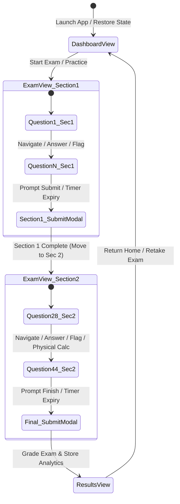

# 🏛️ Software Architecture & Technical Design Document
## CLEP® Calculus Exam Simulator & Learning Engine
**Document Version:** 2.0.0  
**Status:** Active Architectural Specification  
**Target Platform:** Modern Web Browsers (Desktop & Mobile)  
**Live Application URL:** [https://slemay.github.io/clep-calculus-simulator/](https://slemay.github.io/clep-calculus-simulator/)  

---

## 📋 Table of Contents
1. [Executive Summary & System Purpose](#1-executive-summary--system-purpose)
2. [Architectural Principles & Non-Functional Requirements](#2-architectural-principles--non-functional-requirements)
3. [System Architecture & Component Decomposition](#3-system-architecture--component-decomposition)
4. [Data Flow & State Lifecycle](#4-data-flow--state-lifecycle)
5. [Data Models & Schema Specifications](#5-data-models--schema-specifications)
6. [Core Mathematical & Scoring Algorithms](#6-core-mathematical--scoring-algorithms)
7. [Design System & UI Component Specs](#7-design-system--ui-component-specs)
8. [Security, Privacy & Persistence](#8-security-privacy--persistence)
9. [Development, Branching & Deployment Model](#9-development-branching--deployment-model)

---

## 1. Executive Summary & System Purpose

### 1.1 Purpose
The **CLEP® Calculus Exam Simulator** is an enterprise-grade, client-side web application designed to simulate the official College Board CLEP® Calculus examination. The platform provides students with an authentic testing environment, featuring infinite procedurally generated calculus problems, instant LaTeX solution typesetting via KaTeX, realistic section timing constraints, and College Board-aligned 20–80 scaled diagnostic scoring.

### 1.2 System Scope
- **Authentic Timed Exam Simulation**: 44-question exam split into Section 1 (27 Questions, 50 Mins, Non-Calculator) and Section 2 (17 Questions, 40 Mins, Calculator-Permitted).
- **Infinite Practice Engine**: Procedural generation of limits, differential, and integral calculus questions with custom distractors, hints, and step-by-step LaTeX solution breakdowns.
- **Client-Side Scaled Scoring**: Converts raw score counts into official College Board 20–80 scaled scores using non-linear difficulty curves.
- **Zero-Backend Architectural Footprint**: Operates 100% in the client browser with zero external server dependencies, ensuring ultra-fast page loads, total user privacy, and static hosting via GitHub Pages.

---

## 2. Architectural Principles & Non-Functional Requirements

```
                               ┌──────────────────────────────────────────┐
                               │        Vanilla Browser Runtime           │
                               │   (ES6 Native Modules + CSS Variables)  │
                               └────────────────────┬─────────────────────┘
                                                    │
             ┌──────────────────────────────────────┼──────────────────────────────────────┐
             ▼                                      ▼                                      ▼
┌──────────────────────────┐              ┌───────────────────┐                  ┌───────────────────┐
│ Client-Side Math Engine  │              │ KaTeX LaTeX Visual│                  │ Local Storage     │
│ Procedural Generators    │              │ Typesetting (CDN) │                  │ State & Analytics │
└──────────────────────────┘              └───────────────────┘                  └───────────────────┘
```

### 2.1 Design Principles
1. **Zero Runtime Dependencies**: Built with native ES6 JavaScript modules and standard Web APIs. Avoids heavy external frameworks (React, Vue, Angular) to eliminate bundle bloat and maintenance overhead.
2. **Mathematical Ergonomics**: Prioritizes high-contrast LaTeX mathematical rendering (KaTeX), generous font scaling, and zero visual clutter during testing.
3. **Local State Autonomy**: Exam progress and performance metrics auto-save to `localStorage` after every question interaction, guaranteeing full recovery upon accidental refresh or browser closure.
4. **Theme Ergonomics (WCAG AAA)**: Seamless Light/Dark UI system with OS auto-detection (`prefers-color-scheme`) and persistent custom property overrides.

### 2.2 Non-Functional Requirements (NFRs)
- **Performance**: Initial page load under 500ms; mathematical rendering latency under 16ms (60 FPS UI).
- **Availability**: 100% static uptime hosted on GitHub Pages; fully functional offline once cached by browser.
- **Accessibility**: Keyboard navigable, high-contrast text ratios, and distinct visual focus indicators.
- **Cross-Platform Compatibility**: Full responsive support for Chrome, Safari, Firefox, Edge, and mobile browsers.

---

## 3. System Architecture & Component Decomposition

The application is structured into decoupled modules using native ES6 imports:

```text
clep-calculus-simulator/
├── index.html                  # Single Page Application (SPA) DOM container & modals
├── styles.css                  # Design System tokens, CSS variables, & responsive rules
└── js/
    ├── app.js                  # Main Application Controller & State Manager
    └── generators/
        ├── examEngine.js       # Exam Orchestrator & 20-80 Scaled Scoring Engine
        ├── limitsGenerators.js # Limits & Continuity problem generators (~10%)
        ├── derivativesGenerators.js # Differential Calculus problem generators (~50%)
        ├── integralsGenerators.js   # Integral Calculus problem generators (~40%)
        ├── calculatorGenerators.js  # Section 2 calculator-active generators
        └── mathUtils.js        # Mathematical helper utilities (fractions, distractors, LaTeX)
```

### 3.1 Component Responsibilities

#### `app.js` (`CLEPCalculusApp`)
- **Role**: Central Orchestrator & View Switcher.
- **Responsibilities**:
  - Initializes DOM event listeners for navigation, options, palette drawer, hints, and theme toggling.
  - Manages view transitions between `#dashboardView`, `#examView`, and `#resultsView`.
  - Controls exam timer loops (`startTimer()`, `updateTimerDisplay()`) and practice mode pauses.
  - Manages persistent state in `localStorage` (`clep_calculus_active_exam`, `clep_calculus_exam_history`, `clep_calculus_theme`).
  - Triggers KaTeX auto-rendering (`renderMathInElement`) on DOM update cycles.

#### `examEngine.js`
- **Role**: Exam Assembly & Scoring Engine.
- **Responsibilities**:
  - `generateCLEPExam(difficulty)`: Assembles 44 questions across Section 1 (27 Qs) and Section 2 (17 Qs) according to official College Board domain weightings.
  - `calculateCLEPScore(rawScore, difficulty)`: Maps raw score to College Board 20–80 scaled score.

#### `domainGenerators` (`limitsGenerators.js`, `derivativesGenerators.js`, `integralsGenerators.js`, `calculatorGenerators.js`)
- **Role**: Procedural Math Content Factories.
- **Responsibilities**:
  - Generate randomized coefficients, valid LaTeX problem strings, correct answer choices, 4 plausible distractors, contextual hints, and step-by-step KaTeX explanations.

#### `mathUtils.js`
- **Role**: Mathematical Computation & String Helpers.
- **Responsibilities**:
  - Fraction simplification, GCD/LCM, polynomial formatting, derivative/integral term evaluation, array shuffling (Fisher-Yates), and distractor generation.

---

## 4. Data Flow & State Lifecycle

### 4.1 Exam Execution Lifecycle



### 4.2 State Restoration Sequence
1. Page loads `app.js` module.
2. `constructor()` checks `localStorage.getItem('clep_calculus_active_exam')`.
3. If valid JSON exists and exam is incomplete:
   - Deserializes exam instance, user answers, flagged set, timer countdown, current section, and index.
   - Mounts directly to `#examView` at exact active question.
4. If no active exam exists:
   - Displays `#dashboardView` with performance history log.

---

## 5. Data Models & Schema Specifications

### 5.1 Question Object Schema
```json
{
  "id": "q_limits_102",
  "number": 1,
  "section": 1,
  "topic": "Limits & Continuity",
  "subtopic": "L'Hôpital's Rule",
  "questionText": "Evaluate the limit: \\lim_{x \\to 0} \\frac{\\sin(4x)}{2x}",
  "choices": [
    "2",
    "0",
    "4",
    "1",
    "\\text{Undefined}"
  ],
  "correctIndex": 0,
  "hint": "Notice that substituting $x=0$ yields the indeterminate form $\\frac{0}{0}$. Apply L'Hôpital's Rule.",
  "solutionExplanation": "Since $\\lim_{x \\to 0} \\sin(4x) = 0$ and $\\lim_{x \\to 0} 2x = 0$, we have an indeterminate form $\\frac{0}{0}$. Applying L'Hôpital's Rule by taking derivatives of numerator and denominator:\n\n$$\\lim_{x \\to 0} \\frac{\\frac{d}{dx}[\\sin(4x)]}{\\frac{d}{dx}[2x]} = \\lim_{x \\to 0} \\frac{4\\cos(4x)}{2} = \\frac{4(1)}{2} = 2$$\n\nThus, the correct choice is **A**."
}
```

### 5.2 Exam Instance Object Schema
```json
{
  "id": "exam_1723230491823",
  "timestamp": "2026-08-09T15:45:00.000Z",
  "difficulty": "medium",
  "testMode": "exam",
  "section1": {
    "sectionNum": 1,
    "title": "Section 1: Non-Calculator",
    "timeLimitMins": 50,
    "questions": [ /* Array of 27 Question Objects */ ]
  },
  "section2": {
    "sectionNum": 2,
    "title": "Section 2: Calculator Permitted",
    "timeLimitMins": 40,
    "questions": [ /* Array of 17 Question Objects */ ]
  }
}
```

### 5.3 Active State Schema (`localStorage`)
```json
{
  "exam": { /* Exam Instance */ },
  "currentSectionNum": 1,
  "currentQuestionIdx": 12,
  "userAnswers": {
    "q_1": 0,
    "q_2": 3,
    "q_3": 1
  },
  "flaggedQuestions": ["q_3", "q_15"],
  "secondsRemaining": 2430,
  "testMode": "exam",
  "checkedQuestions": []
}
```

### 5.4 Saved History Schema (`localStorage`)
```json
[
  {
    "id": "exam_1723230491823",
    "date": "2/9/2026",
    "time": "3:45 PM",
    "difficulty": "Medium",
    "mode": "Exam",
    "score": 64,
    "rawScore": 34,
    "totalQuestions": 44,
    "percentage": 77,
    "status": "PASS",
    "topicBreakdown": {
      "Limits & Continuity": { "correct": 4, "total": 5 },
      "Differential Calculus": { "correct": 17, "total": 22 },
      "Integral Calculus": { "correct": 13, "total": 17 }
    }
  }
]
```

---

## 6. Core Mathematical & Scoring Algorithms

### 6.1 Procedural Math Problem Generation
Problems are dynamically constructed using randomized parameters bounded by strict mathematical constraints (e.g., non-zero denominators, integer roots, real-valued domains):

$$\text{Polynomial Derivative}: f(x) = a x^n + b x^m \implies f'(x) = a \cdot n \cdot x^{n-1} + b \cdot m \cdot x^{m-1}$$

1. Coefficients ($a, b, c$) are generated via pseudo-random integer samplers within target ranges (e.g., $[-9, 9] \setminus \{0\}$).
2. Distractor choices are constructed by common student error modes (e.g., forgetting chain rule multiplier, sign errors in integration, derivative instead of integral).
3. The choices array is randomly permuted using the **Fisher-Yates Shuffle Algorithm**, adjusting `correctIndex` accordingly.

### 6.2 CLEP® Scaled Score Calculation
The College Board CLEP® Calculus exam reports scores on a **scaled score range of 20 to 80**, with **50** representing the recommended credit-granting threshold. The engine converts raw score ($R \in [0, 44]$) to scaled score ($S \in [20, 80]$) via piecewise linear interpolation with difficulty weighting:

$$S = \min\left(80, \max\left(20, \text{round}\left(20 + \frac{R}{44} \cdot 60 \cdot w_d\right)\right)\right)$$

Where difficulty weighting $w_d$ adjusts scaling curves:
- **Easy Mode**: $w_d = 0.95$
- **Medium Mode (Official CLEP Standard)**: $w_d = 1.00$
- **Hard Mode**: $w_d = 1.08$
- **Extreme Mode**: $w_d = 1.15$

### 6.3 5-Test Rolling Cross-Exam Variety & Deduplication
To ensure users taking repeated practice exams encounter genuinely diverse problem sets:
1. **55+ Unique Problem Generators**: Section 1 (27 Qs) and Section 2 (17 Qs) draw from dedicated pools of distinct generator templates. Every single question in a 44-question exam is produced by a distinct generator (zero generator repeats within a test).
2. **Rolling Signature & Generator Tracking**: The exam engine stores recent question signatures and generator usage frequencies across the last 5 exams in `localStorage`.
3. **Inverse Usage Weighted Selection**: Generators and problem archetypes that have appeared least frequently over the past 5 tests are given top priority during exam assembly, guaranteeing wide variety across multiple consecutive test attempts.

---

## 7. Design System & UI Component Specs

### 7.1 CSS Custom Properties & Design Tokens

```css
:root {
  /* Surface & Background Layers (Dark Mode Default) */
  --bg-primary: #0f172a;
  --bg-surface: #1e293b;
  --bg-card: #334155;
  --border-color: #475569;

  /* Typography & High Contrast Text */
  --text-primary: #f8fafc;
  --text-secondary: #94a3b8;
  --accent-primary: #38bdf8;
  --accent-hover: #0284c7;

  /* Status Colors */
  --success: #10b981;
  --danger: #ef4444;
  --warning: #f59e0b;

  /* Geometry */
  --radius-sm: 8px;
  --radius-md: 12px;
  --radius-lg: 16px;
  --transition: all 0.2s cubic-bezier(0.4, 0, 0.2, 1);
}

/* Light Theme Overrides (WCAG AAA Compliant) */
[data-theme="light"] {
  --bg-primary: #f8fafc;
  --bg-surface: #ffffff;
  --bg-card: #f1f5f9;
  --border-color: #cbd5e1;

  --text-primary: #0f172a;
  --text-secondary: #475569;
  --accent-primary: #0284c7;
  --accent-hover: #0369a1;

  --success: #059669;
  --danger: #dc2626;
  --warning: #d97706;
}
```

### 7.2 Header & Layout Structure
- **Normalized Control Height**: All navbar badges, timers, pause buttons, and secondary triggers locked to exactly `38px` height to prevent alignment jitter.
- **Tabular Numeric Timer**: Countdown timer configured with `font-variant-numeric: tabular-nums` and fixed width (`95px`) to prevent visual oscillation as numbers tick down.
- **Bottom Status Bar**: Uncluttered top navigation; section test mode (`Practice Mode` / `Exam Mode`) and calculator permissions (`Calculator PROHIBITED` / `Calculator PERMITTED`) displayed cleanly in the bottom status strip.

---

## 8. Security, Privacy & Persistence

### 8.1 Privacy Architecture
- **100% Client-Side Execution**: Zero analytics tracking scripts, zero telemetry, zero cookies.
- **Data Isolation**: All exam history and current progress reside exclusively inside browser `localStorage`.
- **No Third-Party Credentials**: No logins, API keys, or user authentication required.

### 8.2 Security & Code Integrity
- **KaTeX XSS Prevention**: KaTeX output is rendered via KaTeX's safe string escaping, preventing arbitrary HTML injection from math text strings.
- **Content Security Policy (CSP)**: Scripts limited to local ES6 modules and verified KaTeX CDN assets (`cdn.jsdelivr.net`).

---

## 9. Development, Branching & Deployment Model

### 9.1 Git Branching Architecture
The repository follows a clean multi-branch release model:

```text
main (v1.0.0 Stable Production) ─────────────────────────────────► Live GitHub Pages
                                  \
v2 (Development Workspace)         └───► Active Feature Redesign & Enhancements
```

- **`main` Branch**: Serves the live, production-grade application on GitHub Pages (`https://slemay.github.io/clep-calculus-simulator/`).
- **`v2` Branch**: Active development branch for major feature updates, UI redesigns, and refactoring.
- **Release Tags**: Immutable version tags (`v1.0.0`, `v2.0.0`) marking official production releases.

### 9.2 Local Development Workflow
No complex build tools, bundlers, or `npm` installations required:

```bash
# Clone repository
git clone https://github.com/slemay/clep-calculus-simulator.git
cd clep-calculus-simulator

# Launch local dev server
python3 -m http.server 8000

# Access application at http://localhost:8000
```
